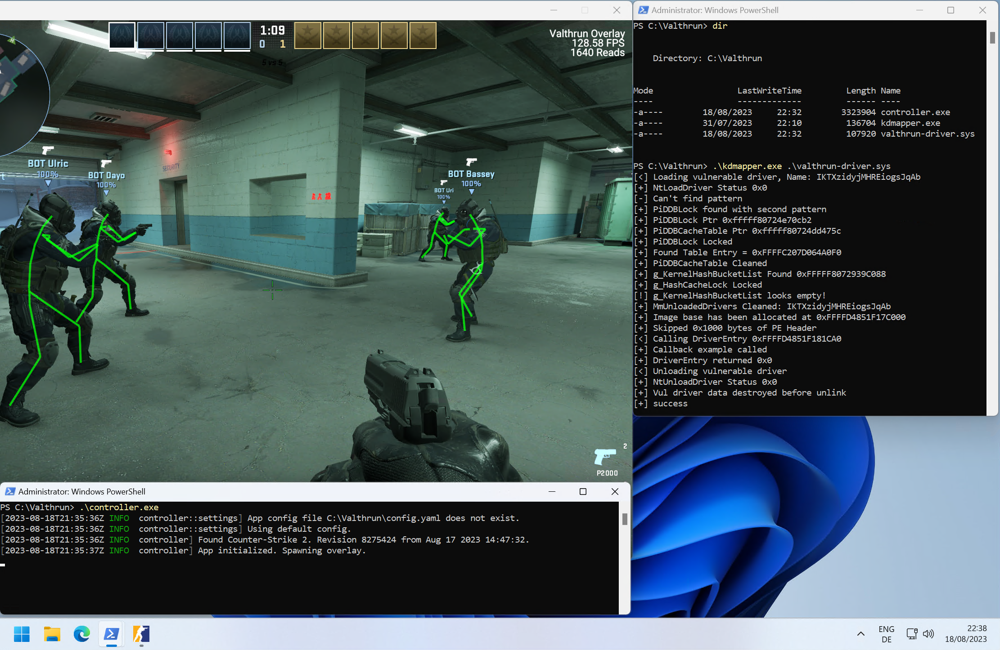

<p align="right">
<a href="https://discord.gg/ecKbpAPW5T">

</a>
</p>

# Valthrun-CHS
Valthrun 是一个开源的 CS2 外部只读内核游戏增强器。
Valthrun-CHS 是前者的简体中文汉化版本。

这是什么意思？  
- `Valthrun` 项目名称。
- `开源` 这个应用程序是开放源代码的，供所有人学习。
- `外部` 我们不向目标进程注入任何 DLL。
- `CS2` 我们要增强的游戏。
- `只读` 我们不会以任何方式写入 CS2 进程，因此无法通过扫描进程内存来检测。
- `内核` 我们不使用任何用户级 WinAPI 从 CS2 进程获取信息。

该项目主要是利用 [Rust](https://www.rust-lang.org) 探索 Windows 内核和游戏增强功能的一个有趣示例 :)

# 警告
Valthrun 目前**不是** pnp (即插即用) 的应用程序。 
请仔细阅读 [如何使用](#如何使用)，并尝试自行排除故障。 
目的是最大限度地避免反作弊检测。
  
# 特性
Valthrun 提供各种外部工具，让您的游戏体验更加精彩。 
目前，Valthrun 只读取内存，从不写入任何内容。这意味着可提供的功能有一些限制。 
*例如，如果不主动修改 CS2 游戏状态 (如写入内存) ，就不可能提供皮肤更换器。*
  
尽管存在这种限制，Valthrun 还是支持以下功能:
- 玩家 ESP
  支持两种模式: `骨架` 和 `方框`
  - 可配置颜色以区分敌我玩家
  - ESP 包括玩家生命值
- 炸弹信息
  - 炸弹倒计时
  - 拆弹信息，如距离拆弹成功还有多久
  - 放置炸弹的地点
- 自动扳机
- Stream proof by default

要打开 Valthruns 菜单，请按 `PAUSE` 键。

## 计划功能
- Aim Bot
- Spectator info
  - List of player currently watching you / the observer target
- Player competitive ranks / wins

# 安装
Valthrun 不需要安裝。 
要运行 Valthrun，你只需要内核驱动程序 (`valthrun-driver.sys`) 和控制器 (`controller.exe`)。
  
这两个版本都可以从 GitHub 下载预编译版本。
点击[这里](https://github.com/WolverinDEV/Valthrun/releases)查看所有发布版本。
  
Once downloaded read [How to use](#如何使用) to get started!

# 如何使用
The following steps need to be done for starting/activating the overlay.
1. Load the kernel driver  
   The overlay requires the kernel driver for all memory reads and writes.
   Therefore we need to load the driver before we can start the overlay. It's not strictly required to load the driver before starting CS2 but logically it makes sense to start with the driver.
     
   There are two common options to load the kernel driver:
   1. Manually map the driver using a vulnerable driver
      The Valthrun kernel driver fully supports manual driver mapping using a any   vulnerable driver. In order to detect the manual mapping the second driver entry argument (the   registry patch) must be a null ptr.  
      The kernel driver will automatically allocate a new driver for io communication.  

      In order to manually map the Valthrun driver you can use tools like  
      - [kdmapper](https://github.com/TheCruZ/kdmapper)
      - [KDU](https://github.com/hfiref0x/KDU) (does not always work...)

   2. Setting Windows into test-signing mode  
      TODO: Explain how to set Windows into test signing
      Helpfull guide: https://github.com/dretax/GarHal_CSGO#starting-driver
   
2. Start Counter-Strike 2  
After loading the driver you can start Counter-Strike 2 as usual.  

3. Start Overlay  
With an open instance of Counter-Strike 2 you can start the overlay.  
Attention: You *must* start the overlay as administrator!  
  
To explore all command line options of the controller, start the controller from the terminal and pass `-h` to display the command line interface:
```ps1
.\controller.exe -h
```

When you want extra/verbose output, start the overlay from the terminal and previously set the `RUST_LOG` environment variable.  
Example for executing the overlay with trace output:  
```ps1
$env:RUST_LOG="trace"
.\controller.exe
```

# Troubleshooting
If you are having issues mapping the kernel driver or starting the controller, please take a look [here](https://github.com/WolverinDEV/Valthrun/tree/master/doc/troubleshooting):  
https://github.com/WolverinDEV/Valthrun/tree/master/doc/troubleshooting
  
The issue you encounter is most likely covered. If you still have any questions or need assistens, feel free to checkout the official Valthrun Discord server ([click to join](https://discord.gg/ecKbpAPW5T)).

# VAC
The same considerations as mentioned in [this link](https://github.com/dretax/GarHal_CSGO#starting-driver) have been taken into account.  
With these precautions and some minor improvements, such as omitting the valthrun identifier and using xor-ing for strings, the driver/overlay should avoid VAC detection. However, I must clarify that I haven't extensively studied VAC, so my conclusion is speculative. Personally, I have been using a C based driver/overlay like this with CSGO for several years without ever getting VAC banned. But be aware of overwatch!  
Unfortunately, since I'm not part of the closed CS2 beta,  
I haven't had the opportunity to test the overlay with VAC live,  
but I assume it should work similarly well.

# Supported Windows Versions
All recent Windows versions should be supported as all functions / struct offsets are resolved dynamically.  
The latest Win 10 and Win 11 versions (22H2) have been tested. User feedback suggests, Windows versions back 'till 20H2 are working.
If you encounter an issue, please submit an issue containing your Windows version and detailing the error you encounter.  
  
# Screenshots



# Help
You can find help on the official Valthrun Discord server:
[](https://discord.gg/ecKbpAPW5T)