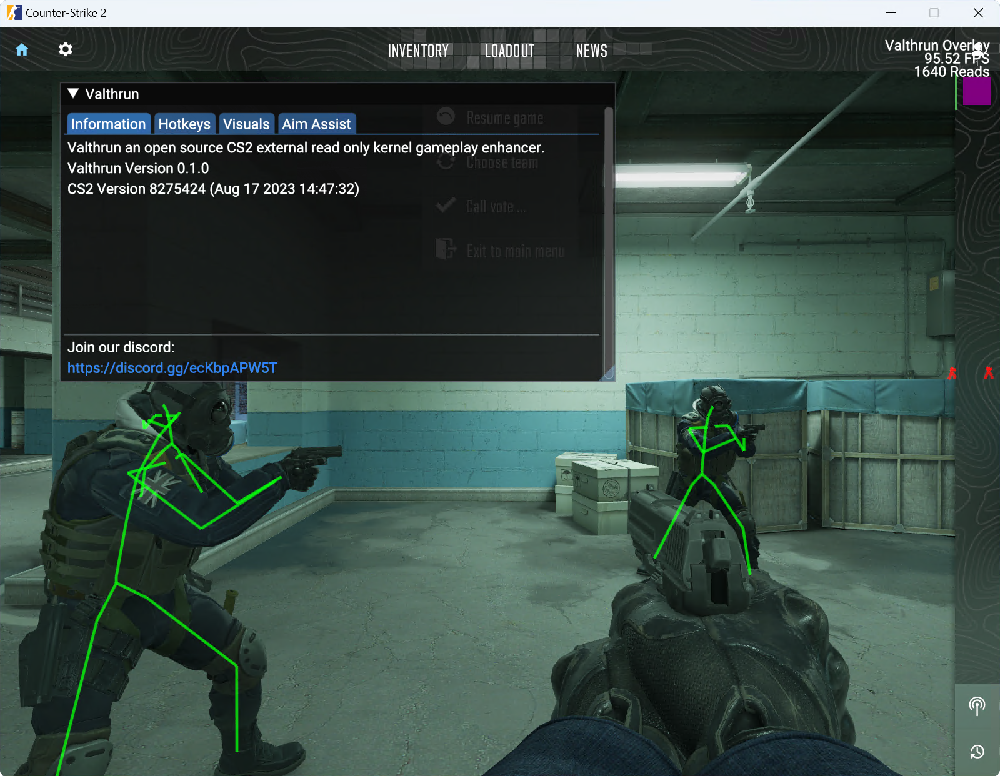

<p align="right">
<a href="https://discord.gg/ecKbpAPW5T">

</a>
</p>

# Valthrun-CHS
Valthrun 是一个开源的 CS2 外部只读内核游戏增强器。
Valthrun-CHS 是前者的简体中文汉化版本。

这是什么意思？  
- `Valthrun` 项目名称。
- `开源` 这个应用程序是开放源代码的，供所有人学习。
- `外部` 我们不向目标进程注入任何 DLL。
- `CS2` 我们要增强的游戏。
- `只读` 我们不会以任何方式写入 CS2 进程，因此无法通过扫描进程内存来检测。
- `内核` 我们不使用任何用户级 WinAPI 从 CS2 进程获取信息。

该项目主要是利用 [Rust](https://www.rust-lang.org) 探索 Windows 内核和游戏增强功能的一个有趣示例 :)

# 警告
Valthrun 目前**不是** pnp (即插即用) 应用程序。 
请仔细阅读 [如何使用](#如何使用)，并尝试自行排除故障。 
目的是最大限度地避免反作弊检测。

🔴 如果你担心**使用本工具后触发反作弊机制从而导致账号受到处罚**，我们建议你**不要使用**本工具。 🔴

⚠️ **使用本工具造成的一切后果由用户自行承担。** ⚠️
  
# 特性
Valthrun 提供各种外部工具，让您的游戏体验更加精彩。 
目前，Valthrun 只读取内存，从不写入任何内容。这意味着可提供的功能有一些限制。 
*例如，如果不主动修改 CS2 游戏状态 (如写入内存) ，就不可能提供皮肤更换器。*
  
尽管存在这种限制，Valthrun 还是支持以下功能:
- 玩家 ESP
  支持两种模式: `骨架` 和 `方框`
  - 可配置颜色以区分敌我玩家
  - ESP 包括玩家生命值
- 炸弹信息
  - 炸弹倒计时
  - 拆弹信息，如距离拆弹成功还有多久
  - 放置炸弹的地点
- 自动扳机
- 旁观者信息
  - 列出**正在观察你**或**与你一起旁观他人**的玩家
- Stream proof by default

要打开 Valthruns 菜单，请按 `PAUSE` 键。

## 计划开发的功能
- Aimbot
- Player competitive ranks / wins

# 如何使用
## 使用一键脚本
[下载脚本](https://lanzoux.com/irPef1bvi62f)，直接运行即可。
如遇到错误或问题请参阅文档中的[疑难解答](https://wiki.valth.run/#/zh-cn/030_troubleshooting/readme)部分。

## 手动运行
详细步骤参考[文档](https://wiki.valth.run/#/zh-cn/)。

To explore all command line options of the controller, start the controller from the terminal and pass `-h` to display the command line interface:
```ps1
.\controller.exe -h
```

If you want a verbose output (useful for troubleshooting), start the overlay from the terminal and previously set the `RUST_LOG` environment variable.  
Example for executing the overlay with trace output:  
```ps1
$env:RUST_LOG="trace"
.\controller.exe
```

# 疑难解答
如果您在映射内核驱动程序或启动控制器时遇到问题，请查看[此处](https://wiki.valth.run/#/zh-cn/):  
https://wiki.valth.run/#/zh-cn/
  
The issue you encounter is most likely covered. If you still have any questions or need assistance, feel free to checkout the official Valthrun Discord server ([click to join](https://discord.gg/ecKbpAPW5T)).

# VAC
我们已考虑到[这个链接](https://github.com/dretax/GarHal_CSGO#starting-driver)中提到的相同注意事项。
有了这些预防措施和一些小的改进，例如省略 Valthrun 标识符和对字符串使用 xor 加密，驱动程序/覆盖层应该可以避免 VAC 检测。不过，我必须澄清，我没有广泛研究过 VAC，所以我的结论只是推测。就我个人而言，我在 CSGO 中使用这样基于 C 语言的驱动程序/覆盖程序已有数年，从未被 VAC 禁止过。但要注意超视距！
随着 VAC live 的启用，请谨慎使用。一如既往地采取必要的预防措施。

> **用就别怕，怕就别用。**
> **Use it and face the consequences, or don’t and be safe.**

# Screenshots



# Help
You can find help on the official Valthrun Discord server:  
[](https://discord.gg/ecKbpAPW5T)
